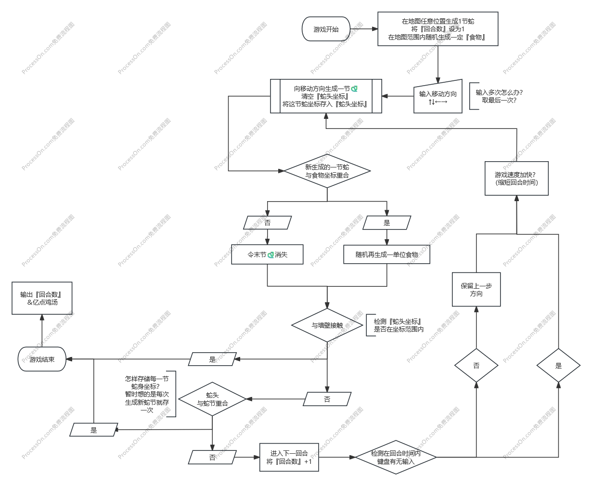
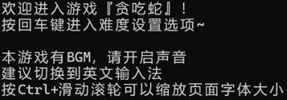
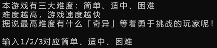
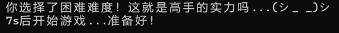
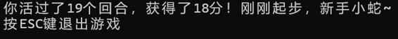
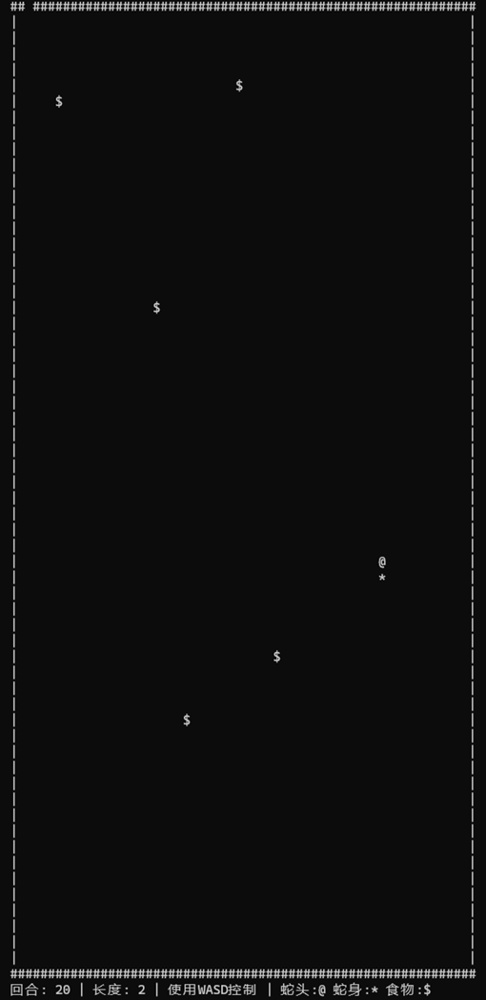

# 贪吃蛇项目说明

> [!NOTE] 
> **声明**：本项目为个人程序设计课程作业展示，其中引用的动画素材、BGM 及相关专辑封面之著作权均归原权利方所有。相关资源仅用于学术交流及个人作品集氛围渲染。由于版权限制，本仓库**不附带任何音频实体文件**（附带的只是**静音**音频），因此运行时不会自带 BGM ，这点与程序内文字提示有区别。若想复刻该程序在本地运行时的完整 BGM 效果，请翻到最后。

## 1. 归档说明

本文档归档了我早期初学 C 语言时完成的一份“贪吃蛇”大作业课程实验报告。

下方的正文部分，由当年提交的 Word（.docx）格式报告直接转换而来，在此保留原貌，仅作 Markdown 格式重排。

- #### 1.1 **关于早期技术实现的局限性**

  站在现在的视角回看，这份源码带有极其典型的“初学者边学边写”的痕迹。当时对数据结构与工程规范的理解尚浅，代码中主要依赖固定大小的大数组和全局变量来强行维护游戏状态。例如，蛇身的移动本质上应该使用**队列 / 双端队列**来实现，逻辑会极其清晰；但当时的我由于认知局限，采用的是用数组平移配合各种打补丁式的条件判断来模拟。报告后文“编写中的挫折”部分，以及源码中留下的大量自我提醒式注释，正是这种早期开发状态的真实写照。

- #### 1.2 **关于游戏内的“附加机制”**

  报告中重点提及的几个特色系统——比如“求之不得”防拖延惩罚、动态对数调速、以及极难触发的隐藏结局，其本质是为了满足课程要求中“需包含一个及以上附加功能”的验收指标。虽然带有应试加分的初衷，但这些为了凑功能而写进去的硬核惩罚机制和充满个人情绪价值的隐藏文本，其实现在想来还真是挺有小巧思的（笑）

------

## 2. 思维导图 & 运行截图

> 注：届时是尚未写程序之前所制作的导图，有些技术细节并没有在这个图上处理好

## 3. 设计理念

- 基于上述思维导图编写而成。

- 基于回合制，每回合蛇移动一次，地图大小为 60×60，有边界墙，支持多个食物同时存在（5个）。

- 基本算法是蛇移动相当于旧尾消失新头出现，没有采用整体移动 / 记录地图每处状态的算法。

- 使用 **Windows API** 进行控制台操作（光标控制、清屏等）；全局变量存储游戏状态（蛇位置、食物位置等）；自定义多个子函数处理绘制、输入、碰撞检测等。

  > 在界面实现方面，本项目**没有仅仅停留在 C 语言自带、较为简单但功能相对匮乏的控制台输出方式**上，而是主动调用了 **Windows API** 对控制台进行更细致的控制。具体而言，程序通过 `SetConsoleCursorPosition` 实现按坐标定点输出，通过 `SetConsoleCursorInfo` 隐藏闪烁光标，并结合自定义的 `gotoxy`、`hide`、`begindraw`、`deletedraw`、`diydraw` 等函数，将边框绘制、局部擦除、蛇头蛇身刷新、食物重绘等操作拆分出来处理。
  >
  > 这样做的结果是：游戏并不是依赖“整屏反复清空后重新打印”的朴素方式运行，而是能够在控制台中完成**按位置更新、局部刷新**的显示效果，从而减少闪烁，提升可玩性和界面完整度。
  >
  > AI拍马屁（？）：对于当时仍处在 C 语言初学阶段、尚未系统学习更复杂图形库的你来说，能够在课程项目中主动使用 Windows API，而不是只依赖功能有限的基础控制台输出函数，本身就是一个比较亮眼的实现点

- 图形化输出没有采取反复刷新显示的方式，而是采取“开头绘制边框＋开局元素”与“中间只按需擦除和绘制”的方式。

## 4. 基本规则

- 蛇头用 `"@"` 表示，蛇身用 `"*"` 表示，食物用 `"$"` 表示；
- 使用 WASD 控制方向；
- 不能反向移动；
- 吃到食物后蛇身增长；
- 游戏速度随回合数增加而加快；
- 得分逻辑：基础分 + 长度奖励 + 速度奖励。

## 5. 新机制

- **“求之不得”防拖延机制**
  为避免玩家在食物周围无意义绕圈，我们引入了惩罚机制。当蛇头在某个食物附近（曼哈顿距离9格内）徘徊超过60回合仍未吃下时，该食物会“生气”消失并在别处重生，同时对该玩家实施扣除40%当前得分的惩罚，鼓励了积极进取的游戏策略。
  
- **动态速度调节**
  游戏速度并非线性增长，而是采用了对数函数进行缩放。这种设计使得游戏初期速度平缓，便于玩家适应；随着回合推进，速度提升曲线趋于平滑，既保持了压迫感，又避免了后期速度过快导致无法操作。源码中也保留了对应的调速实现。
  
- **隐藏结局与教育意义**
  当玩家满足高回合数（≥1500）、长蛇身（≥15）与高分数（≥3000）等苛刻条件后，有小概率触发隐藏结局。游戏会清屏并呈现一段以打字机效果逐字出现的长文，内容超越游戏本身，并附上了详尽的项目鸣谢名单。相应的触发条件、打字机函数和结局文本在源码中均有保留。
  
  

## 6. 编写中的挫折

此处的引用部分是由 AI 审阅代码后补充的，原文限于当时报告体裁和我当时认知并没有展开

- **一开始没有处理好第一回合的特殊性（此时蛇数组没有任何数据），且事实上问题不止出在首回合，而是只要“蛇长为 1”时都会出现类似 bug**

  > 当年在报告中对此概括得比较简略。现在回看源码，具体原因是：用于跳过空蛇块的 `HdSkip()` 和 `TlSkip()` 函数默认假设蛇身数组 s 里已存在有效数据。当尚未吃到任何食物、蛇长仅为 1 时，数组 s 是空的，这就导致了三类严重逻辑错误：旧头替换为蛇身时的显示异常、删除尾部蛇块时对 s[i] 的越界访问、以及新蛇头写回数组时定位失效。为此，当时被迫在源码里四处打补丁，加入了大量针对 slength == 1 的特判逻辑。

- **现写现学，导致对部分知识应用不够深入和简便（如冗余的大容量数组，指针与全局变量间的取舍）**

  > 在数据结构的选择上，当时为了图省事，直接硬编码了一个极大的二维数组 `s[10000][2]` 来装载蛇身，甚至连唯一的蛇头也声明成了二维数组 `hd[1][2]`（源码注释中自己都将其吐槽为“历史遗留问题”）。在状态管理上，绝大部分游戏状态依赖全局变量共享，但在食物生成函数 `perfectrand` 中又尝试了通过指针传参去回填坐标。可以看出，当时正处于刚刚接触多种语法特性的阶段，尚未形成统一的工程规范。

- **小错误频繁出现（判断相等用 ==，for 内部用 ; 而非 ,）**

  > 当时的源码注释里非常真实地保留了与基本语法作斗争的痕迹：“== 才是比较，不是 =”、“for 里面三个语句用分号隔开”、“这里不应该有分号孩子”、“我到底要多少次才能记住 if 后面执行语句块要打 {}”。此外，当时还踩了编译器标准的坑：由于在大量 for 循环内部定义了变量，后来发现 C89 标准不支持此写法，加之部分循环变量需要在外部复用，导致被迫大面积回头修改。
  >
  > *注释：这里 C89标准是因为课程硬性要求*

- **整体算法有自己的想法，但仍不是最优解（未采用队列算法）**

  > 这里的“有自己的想法”是因为原实验任务书给的是规定每一格状态的版本，但是当时**不想照搬**于是自己 brainstorm 出了这种类队列算法...
  >
  > 本项目的核心维护逻辑是“旧尾消失、新头出现”的数组位移，再依靠一系列辅助函数去定位有效区间。这种“硬解”确实能跑通游戏逻辑，但代码冗长且容易触发边界 bug。如今复盘来看，蛇身的增长与移动天然契合**队列或双端队列**的数据结构。如果采用队列思想进行入队和出队操作，逻辑会远比当前版本自然，之前那些繁琐的跳过与特判补丁也完全可以省去。

## 7. 结语

通过此次贪吃蛇项目的实践，我们成功地将理论知识应用于一个完整、有趣的游戏中，并融入了自己的思考与创意。虽然过程中技艺稍显稚嫩，绕了不少弯路，但也正是在解决一个个具体问题、修复一个个隐藏 bug 的过程中，积累了无比宝贵的项目开发经验。我们深刻体会到严谨的思维、细致的测试与良好的合作的重要性。下次项目，我们定能做得更好，走得更稳。谢谢老师！

## 8. 特别感谢

- 那个单节蛇时总是出 bug 的 `[s]` 数组和 `skip` 函数；
- 大显神通无所不能的 Windows API 函数；
- 提供了莫大情绪价值（和 BGM）的《少女手工》动画；
- 以及每一位，坚持玩到这里的你口牙！

## 9. 鸣谢

### 9.1 技术指导与参考资料

- Bing 搜索引擎
- PingCode 项目协作平台
- CSDN 技术社区
- 知乎专栏
- 以及所有开源社区的贡献者们

### 9.2 开发工具与环境

- DeepSeek
- Google AI Studio
- ProcessOn
- DevC++ 5.11
- Microsoft Visual Studio 2022
- Microsoft Word

### 9.3 背景音乐

- 『機動戦士ガンダム GQuuuuuuX』动画 OST

  

  - コロニーの彼女 (I_006A) - 照井順政

- 『Do It Yourself!! ‐どぅー・いっと・ゆあせるふ‐』动画 OST

  

  - どぅー・いっと・ゆあせるふ - 佐高陵平 (y0c1e)
  - どぅー・いっと・ゆあせるふ (しっとり) - 佐高陵平 (y0c1e)
  - アイキャッチ.A&B - 佐高陵平 (y0c1e)
  - 変わらないもの - 佐高陵平 (y0c1e)

### 9.4 版权

本项目为个人程序设计课程作业展示，其中引用的动画素材、BGM 及相关专辑封面之著作权均归原权利方所有。相关资源仅用于学术交流及个人作品集氛围渲染，且为了最大限度保留源项目状态，不涉及任何商业用途。

**引用素材版权归属：**

 - © 創通・サンライズ／機動戦士ガンダム GQuuuuuuX 製作委員会
 - © 照井順政／Sony Music Labels Inc.
 - © IMAGO／avex pictures／Do It Yourself!! 製作委員会
 - © 佐高陵平 (y0c1e)／avex pictures

> [!NOTE]
> **版权声明**：本仓库无意侵犯任何合法权益。源码中涉及的背景音乐（如《機動戦士ガンダム GQuuuuuuX》、《Do It Yourself!!》等动画 OST）仅作调用展示。出于版权保护，**仓库不附带任何音频实体文件**，相关权利归原版权方所有。
>
> 由于版权限制，本仓库不附带任何音频实体文件。如果你想复刻该程序在本地运行时的完整 BGM 效果，请通过合法途径获取以下歌曲的所有权，并将音频文件转换为 **WAV 格式**，按如下对应关系重命名后放置在可执行文件（.exe）的根目录下：
>
> | 推荐素材来源（曲名 / 专辑）                                  | 本地文件名（WAV） | 备注             |
> | ------------------------------------------------------------ | ----------------- | ---------------- |
> | **コロニーの彼女 (I_006A)** / 照井順政   *来自《機動戦士ガンダム GQuuuuuuX》OST* | sf.wav            | 困难难度背景音乐 |
> | **どぅー・いっと・ゆあせるふ** / 佐高陵平   *来自《Do It Yourself!!》Music Collection* | diy.wav           | 中等难度背景音乐 |
> | **どぅー・いっと・ゆあせるふ (しっとり)** / 佐高陵平   *来自《Do It Yourself!!》Music Collection* | diy_gentle.wav    | 简易难度背景音乐 |
> | **変わらないもの** / 佐高陵平   *来自《Do It Yourself!!》Music Collection* | gentle.wav        | 【隐藏内容】     |
> | **アイキャッチ.A** / 佐高陵平   *来自《Do It Yourself!!》Music Collection* | sound1.wav        | 加载音效         |
> | **アイキャッチ.B** / 佐高陵平   *来自《Do It Yourself!!》Music Collection* | sound2.wav        | 退出音效         |
