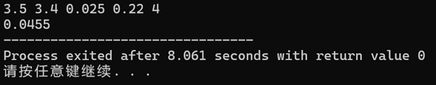

# 《程序设计基础》试点班课内项目设计报告

## 金融市场定价模拟编程项目

完成日期：2025年10月30日

转录日期：2026年4月6日

------

## 1. 补充说明

（此部分由 AI 辅助编写）

本文档归档了我大一上在程序设计基础试点班完成的一份课程实验报告，当时尚初学 C 语言。

下方的正文部分，由当年提交的 Word 格式报告直接转换而来。因为当时需要严格遵循学校课程给定的实验报告模板要求，所以行文格式带有典型的“实验报告式”的死板（笑），在此保留原貌，仅作 Markdown 格式重排。

结合现在的视角，对当年的项目作两点补充说明：

#### **1. 关于项目的真实业务模型**

这个项目在口头语境中常被简称为“股票价格预测”，但回归题面本身，它实际上是一个标准的金融衍生品定价问题。题目要求防范资产下跌风险并锁定卖出价，其实质是要求计算**看跌期权**的理论价格。本项目最终落实的是**二叉树模型**，其核心是在风险中性假设下计算可能的价格期望并折现，而非预测单一的未来股价走势。

#### **2. 关于早期代码实现的局限性**

作为初学阶段的代码，当时的重点在于“把数学模型硬翻译成能跑的 C 语言”，从现有代码看，当时的实现主要仍依赖**数组、循环、条件判断、函数调用**等基础程序设计内容；虽然代码中已经出现了**指针、动态内存分配与手动释放内存**等内容，但整体仍明显带有边学边写、边调试边修补的特征。因此在工程实现上存在明显的局限性：

- **空间复杂度过高：** 当时采用了将二叉树节点完全展开的逻辑，导致底层节点数随时间指数级增长，只能靠引入动态内存分配（malloc/free）来强行规避栈溢出。实际上使用一维数组反向递推即可大幅压缩空间开销。
- **全局变量滥用：** 像行权价 `KK` 这样的核心参数被直接定义为全局变量并在函数中调用，甚至引发过变量名冲突，没有遵循良好的函数参数传递规范。
- **浮点数边界处理粗糙：** 为了规避浮点数运算精度导致的向下取整误差，当时在代码中采用了直接加 1e-2 的硬编码补丁。

上述问题均属于初学阶段的局限。下方的报告正文保留了当时的原始记录，反映了从理解金融模型到程序初步落地的完整过程。

------

## 2. 需求分析

项目需求我们亲手实现一个在金融界被广泛使用的基础模型——二叉树模型。这个模型强大之处在于，我们可以利用市场实时给出的、动态变化的 σ，来为各种复杂的未来风险进行定价。

更进一步地，金融、物理、工程等领域充满了数学模型。将一个带有公式、下标和迭代逻辑的理论模型，准确无误地翻译成结构清晰、高效运行的计算机代码是一项核心的工程技能，考验是精确的实现能力。

------

## 3. 整体设计

### 3.1 功能设计

本项目主要难度在于理解，而算法并不复杂，故不需要太过复杂的设计，也确实只用了两个子函数。

#### 3.1.1 **Ma整形函数**

计算最大值（以防C89库里没有max函数）。

#### 3.1.2 **Calk整形函数**

快速由价格计算看跌期权（命名：Calculate+k行权价）。

#### 3.1.3 **主函数**

实现主要功能和算法。

### 3.2 数据结构设计

类似的，本项目的数据结构并不复杂。大部分变量都只用在主函数中调用，故只在 `main` 函数中声明即可。

除了……**行权价 K**。因为它要在 `calk` 中使用。

值得注意的是，由于到期周数可能很高（故数组中元素个数可能很高），所以使用普通数组声明会报错，故使用**动态分配内存**。

此外，由于 `pow` 内部使用 Float 型变量计算，故整数的整数次方使用再“**+1e-2**”的方式以规避无穷小数（如 1.99999）被舍去的问题。

### 3.3 算法设计整体思路

我们假设，从现在到（若到期周数为4）4周后，每周只可能发生两件事：ETF 价格**上涨一点点**（乘以一个系数 `u`），或者**下跌一点点**（乘以一个系数 `d`）。

#### 3.3.1 **正推价格**

**现在（第0周）**：价格是 3.5。

**第1周后**：价格可能变成 3.5 * u（涨）或者 3.5 * d（跌）。

**第2周后**：就有四种可能了：涨涨、涨跌、跌涨、跌跌。

……

**第4周后（到期日）**：我们就会得到很多个最终的可能价格。

#### 3.3.2 **在终点计算价值**

在第4周的每一个最终价格节点上，我们都能算出这份期权值多少钱。

计算方法就是 `max(0, K - S₄)`，即 `max(0, 3.4 - 当时的价格)`。

值得注意的是，由于此处是担心股价下跌，所以是**看跌期权**。

举例说明，如果某个分支的最终价格是 3.1 元，那这份期权就价值 0.3 元。如果最终价格是 3.8 元，那这份期权就一文不值，价值为 0。

#### 3.3.3 **逆推期权（动态规划的核心）**

我们站在第3周的某个节点上，它下一周会走向一个“上涨”的节点和一个“下跌”的节点，这两个节点的期权价值我们刚刚已经算出来了。

模型用“风险中性概率 q”来计算这两个未来价值的**期望值**，价值 = `(q * 上涨后的期权价值 + (1-q) * 下跌后的期权价值)`。

算出期望值后，再考虑金钱的时间价值（用利率 `r`），把它**折现**回第3周，算出第3周所有节点的期权价值。

然后用同样的方法，从第3周推回第2周...再推回第1周...**最后，推回到第0周（今天）**。

最终在起点（第0周）得到这份期权在今天的**“理论公平价”**。

------

## 4. 人员整体分工

无（单人项目）。

------

## 5. 关键模块详细设计

### 5.1 主函数-标价计算

#### 5.1.1 **目标**

计算并存储从现在到未来的所有可能价格路径。

#### 5.1.2 **数据结构**

一个二维数组 `s[5][16]`，可以想象成一个表格。行代表时间（0到4周），列代表在该时间的各种可能性。

#### 5.1.3 **逻辑**

1. **设定起点**：`s[0][0] = s0`。将我们的出发点放入表格的左上角。
2. **逐层递推**：使用两层嵌套循环，从第1层（周）开始，计算到第4层。
3. **递推规则**：第 `i` 层的每个节点的价值，都由第 `i-1` 层的某个父节点乘以 `u`（上涨）或 `d`（下跌）得到。`s[i][2*j]` 和 `s[i][2*j+1]` 共享同一个父节点 `s[i-1][j]`。
4. **注释**：具体地说，第i号数据得出了下一周的2i和2i+1号数据。所以第0~3周都会有很多无伤大雅的空值。

#### 5.1.4 **结果**

一个被完全填充的 `s[][]` 数组，表示各个节点处的标价。我们会继续使用的最终价格，就存放在 `s[4][]` 中。

### 5.2 主函数-期权计算

#### 5.2.1 **目标**

从已知的终点价值出发，逆向推导出起点的价值。

#### 5.2.2 **数据结构**

另一个二维数组 `option[5][16]`，结构与 `s[][]` 完全对应。

#### 5.2.3 **逻辑**

1. **计算终点价值（边界条件）**：这是倒推的起点。我们先单独处理第4层。遍历 `s[4]` 的所有16个终点价格，利用公式 `option[4][i] = max(0, K - s[4][i])`，计算出在所有结局下期权的确定价值，并填充到 `option[4]` 中。
2. **逐层回溯**：使用两层嵌套循环，但这次时间 `i` 是从3倒着走向0。
3. **回溯规则**：第 `i` 层的某个节点 `option[i][j]` 的价值，取决于它在下一层 `option[i+1][2*j]` 和 `option[i+1][2*j+1]` 的价值。计算公式为：先按风险中性概率求期望，再乘以折现因子。
4. **结果**：一个被完全填充的 `option[][]` 数组。我们最关心的最终结果，就存放在起点 `option[0][0]` 中。

------

## 6. 编码和实现

### 6.1 硬件环境

无

### 6.2 软件环境

C89编译器

### 6.3 编程语言

100.0% C

### 6.4 关键模块的实现代码

#### 6.4.1 标价计算

```c
//到期周数过大时可能会栈溢出，故动态分配内存
//double s[w+1][cir] ;//= { 0 };//标价
s[0][0] = s0;
{
    int i, j;
    for (i = 1; i <= w; i++) {
        for (j = 0; j <= pow(2, i - 1) - 1; j++) {
            s[i][/*2j*/2*j] = s[i - 1][j] * u;//你再写2j试试 
            s[i][/*2j*/2*j + 1] = s[i - 1][j] * d;
        }
    }
}
```


#### 6.4.2 期权计算

```c
//期权
double** option;
option = (double**)malloc((w + 1) * sizeof(double*));
{
    int i;
    for (i = 0; i <= w; i++) {
        option[i] = (double*)malloc(cir * sizeof(double));
    }
}
//double /*k*/option[w+1][cir] ;//= { 0 };//不要变量名和数组名重复了 
{
    int i;
    for (i = 0; i <= cir-1; i++) {
        /*k*/option[w][i] = calk(s[w][i]);
    }//计算终点价值
}

{
    int i, j;
    for (i = w-1; i >= 0; i--) {
        for (j = 0; j <= pow(2, i)+ 1e-2 - 1; j++) {
            /*k*/option[i][j] = q * /*k*/option[i + 1][/*2j*/2*j] + (1 - q) * /*k*/option[i + 1][/*2j*/2*j + 1];
            /*k*/option[i][j] *= di;
        }
    }
}
```

------

## 7. 实现界面



------

## 8. 总结与展望

### 8.1 **总结**

这次编程代码量不高，算法也不算复杂，而难点在理解模型上。这让我意识到：CS的难处不一定是复杂的算法或是高超的 coding，而也在精确匹配各个专业领域客户的需求，将代码与应用匹配。

### 8.2 **改进的想法**

编程过程中小问题频繁发生（下为一次重大 debug 现场）。

#### 8.2.1 代码中的错误点分析

> **1. 期权的最终价值计算错误（概念性错误）**
> **位置：** `calk` 函数
> **问题：** 你的函数写的是 `ma(0, hatsunemiku - k)`，也就是 `max(0, S - K)`。
> **分析：** 这是看涨期权（Call Option）的价值公式，代表“用约定价K买入股票的权利”。而李先生担心暴跌，他需要的是看跌期权（Put Option），即“用约定价K卖出股票的权利”。它的价值应该是“约定的卖出价”减去“当时的市场价”。
>
> **2. “风险中性概率 q” 的计算公式错误（数学实现错误）**
> **位置：** `main` 函数中的 `q` 计算行
> **问题：** `float q = exp((r * t - d) / (u - d));`
> **分析：** 你把 `exp()` 函数套在了整个表达式的外面。请再仔细看一下公式：`q = (e^(r*∆t) - d) / (u - d)`。这里的 `e^(...)`，也就是 `exp()`，应该只作用于 `r*t` 这一小部分，而不是整个分数。
>
> **3. 变量名冲突与作用域问题（最关键的程序逻辑错误）**
> 这是导致你输出 `3.5000` 的最直接原因。
>
> **位置：** `main` 函数和全局变量声明
> **问题：**
>
> - 你在 `main` 函数的开头通过 `scanf` 读取了行权价 `k`。
> - 但是，随后你又定义了一个二维数组，也叫 `k`：`double k[5][16] = { 0 };`。在 `main` 函数的这个大括号内，`k` 这个名字从此以后就代表这个数组了，之前那个浮点数 `k` 被“覆盖”了。
> - 你的 `calk` 函数在计算时，使用的是它能访问到的、在函数外定义的全局浮点数 `k`。
> - 你在 `scanf` 的格式化字符串中，把 `,` 写了进去：`scanf("%f,%f,%f,%f,%f", ...)`。这意味着你的输入必须是 `3.5,3.4,0.025,0.22,4` 这种带逗号的格式。如果你输入的是用空格隔开的样例，那么从第二个变量 `k` 开始，所有变量都没有被正确读入。
>
> **后果：**
> 综合第3和第4点：`scanf` 读取 `k` 失败，导致全局浮点数 `k` 的值是0或者一个不确定的初始值。因此，你的 `calk` 函数实际上在计算 `max(0, S - 0)`，结果恒等于 `S`。最终导致在第4回合，你的“期权价值”数组 `k[4]` 里的值，其实就是股票价格 `s[4]` 的值。然后你一路把股票价格折现回来，结果当然就是当前的股价 `s0`。

#### 8.2.2 其他改进想法

1. 虽然 `2^n` 可能很大，但是仍没有及时意识到要使用动态内存分配。
2. **始终没有办法得出**“样例输出：0.0046”意欲的结果（而是0.0455），已经反复检查代码仍然未发现问题，不得而知问题何在。
3. 难以理解金融模型含义，初期借助了过多 AI 工具的讲解，说明理解专业模型能力欠缺

------

## 9. 感想和致谢

### 9.1 感想

希望能有参与真正项目/课题的机会，哪怕名额少一点也没关系（

### 9.2 致谢

- Gemini 2.5 Pro / Google AI Studio

- 《劇場版プロジェクトセカイ 壊れたセカイと歌えないミク》（提供编程中的情绪价值）
