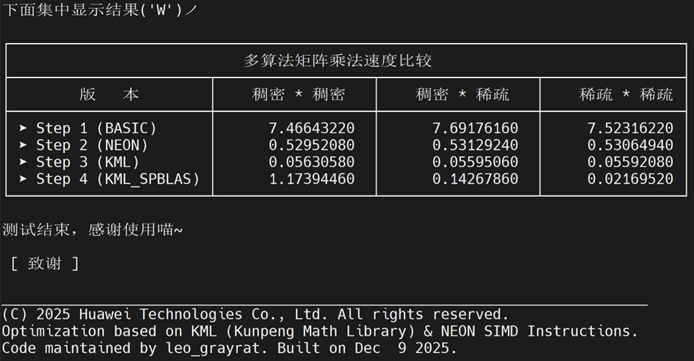

> 本文由 GPT 依据原设计说明书、调试记录、源码与构建脚本重写，因为是整理远古项目所以没有精力完全重写，但是自己已经审过了。
>
> *但是我还是要说，GPT 5.4 现在生成文稿文风很奇怪，还经常 ooc 努力告诉用户“你看，我改了/我区分了”或者奇怪煽情，真的比 Gemini **差远了***

## 前言 / 归档说明

**本项目本身是在 MobaXterm 学校云服务器上进行工作的，因此如果想复刻该项目，也需要在类似的部署了各种所需库的 Linux 环境下进行操作，且链接路径很有可能与本项目原生环境不一样。**
**若想获取华为 KML 等库，请在华为和鲲鹏官方网站寻求支持，本项目不提供这些内容。**

这份文档是我在大一上《程序设计基础》试点班时期完成的课内实验报告。当时我必须沿用课程给定的 docx 报告书格式，因此正文会明显偏正式、偏模板化，现在将它整理为 Markdown 版本公开存档。

从现在的视角回看，这个项目真正有价值的部分，并不只是朴素矩阵乘法、NEON、`KML_BLAS`、`KML_SPBLAS` 这四条路线本身，而是我在实现过程中被迫面对的一整套工程问题：连续内存与二维索引如何兼得、本地 `VS` 与远端 `Linux`/鲲鹏环境如何共存、`posix_memalign` 这种带有二级指针语义的接口如何正确调用、稀疏矩阵如何从普通二维数组压缩到 `CSR`、以及编译器和库路径不能自动找到时该怎样自己把 `-I`、`-L`、`rpath` 和头文件层级理顺。

当然，这个版本的局限性也很明显：

- 我当时仍然处在“边学边写”的阶段，很多命名、注释与文件拆分都带有明显的试错痕迹。
- 四套方案主体流程高度相似，但没有继续抽象出更统一的测试框架。
- 项目强依赖特定平台与特定库，移植性并不强。
- 从算法层面看，我并没有继续深入到分块、缓存分层优化、真正意义上的 benchmark 设计，而是主要停留在课程目标要求的范围内。
- 真正重要的探索过程，很多并不在那份最初的课程报告里，而在源码注释、构建脚本和调试记录里。

------

> 《程序设计基础》课内项目设计报告

# 矩阵乘法优化项目 设计说明书

**完成日期**：2025-12-09

## 1. 需求分析

矩阵乘法是科学计算、深度学习及工程仿真中的核心算子，其计算复杂度高达 `O(N^3)`。当矩阵规模达到 `1024 × 1024` 这一量级时，朴素串行算法在运行时间和内存访问效率上都会面临明显瓶颈。因此，本项目希望围绕如下问题展开实验：

- 如何实现最基础的矩阵乘法，并得到可靠的性能基线。
- 如何利用 `ARM NEON` 指令集完成向量化优化。
- 如何利用**华为** `KML_BLAS` 与 `KML_SPBLAS` 库完成进一步加速。
- 如何在稠密与稀疏两种场景下，对比不同实现方案的运行表现。
- 如何在本地 `Visual Studio` 与远端 `Linux` 服务器之间维持尽量统一的代码结构。

> 补充说明：从结果上看，这个项目像是在比较四种算法；但从实现上看，它真正训练我的地方其实是“把同一份矩阵数据同时喂给普通三重循环、NEON、BLAS 和 SPBLAS”这一过程。也就是说，难点不在于把某个库名记住，而在于如何把自己的数据结构、内存布局、编译环境和接口约束全部对齐。

## 2. 整体设计

### 2.1 功能设计

本项目采用模块化设计，以 `main.c` 为统一调度中心，通过 `function.h` 汇总结构体与函数声明，将不同的计算策略拆分到不同源文件中。

各模块分工如下：

- **主控模块（`main.c`）**
  - 负责统一调用各个算法版本。
  - 负责收集返回的计时结果。
  - 负责以统一格式输出最终性能对比表。
- **通用工具模块（`general.c`）**
  - 负责矩阵随机初始化。
  - 负责矩阵清零。
  - 负责稀疏化处理，即随机将约 `90%` 元素置为 `0`。
- **基础计算模块（`basic.c`）**
  - 负责实现朴素 `O(N^3)` 三重循环矩阵乘法。
  - 作为后续优化方案的性能基线。
- **向量化模块（`neon.c`）**
  - 负责使用 `ARM NEON` 指令集进行手写向量化。
  - 通过 `vld1q_f32`、`vdupq_n_f32`、`vmlaq_f32`、`vst1q_f32` 等接口完成乘加。
- **稠密库计算模块（`kblas.c`）**
  - 负责调用 `KML_BLAS` 中的 `cblas_sgemm`。
  - 负责处理对齐分配与连续内存要求。
- **稀疏库计算模块（`huawei.c`）**
  - 负责将普通矩阵压缩为 `CSR` 结构。
  - 负责调用 `KML_SPBLAS` 中的 `kml_sparse_scsrmultd`。
- **环境适配模块（`local_mock.h`）**
  - 负责为本地 `Visual Studio` 提供伪声明。
  - 使我在本地虽然无法真正运行鲲鹏专用代码，但至少可以获得语法检查、智能提示与多文件联调体验。

### 2.2 数据结构设计

本项目中真正关键的数据结构并不多，但都很重要。

- **`CSR` 结构体**

  ```c
  typedef struct ChinaSuperRed {
      int homo;
      int size;
      float* values;
      int* colidx;
      int* rowptr;
  } CSR;
  ```

  其中：

  - `homo` 表示非零元素个数。
  - `size` 表示矩阵规模。
  - `values` 存储所有非零元素。
  - `colidx` 存储对应列号。
  - `rowptr` 存储每一行在 `values` 中的起始位置。

- **`mt` 结构体**

  ```c
  typedef struct modeltime {
      double denden;
      double spaden;
      double spaspa;
  } mt;
  ```

  其中：

  - `denden` 表示稠密 × 稠密平均时间。
  - `spaden` 表示稀疏 × 稠密平均时间。
  - `spaspa` 表示稀疏 × 稀疏平均时间。

### 2.3 实现特点

相较于单纯介绍四种算法，本项目更值得记录的几个实现特点如下：

- **连续内存与二维索引同时保留**
  - 我没有直接采用“每一行单独 `malloc`”的碎片化二维数组。
  - 我采用了“整块分配 + 行指针映射”的方式，使底层内存连续、上层仍可写成 `A[i][j]`。
- **本地与服务器双环境共存**
  - 我没有在本地硬装一整套鲲鹏与 `KML` 环境。
  - 我采用条件编译，让 `VS` 读伪声明、本地过语法；让服务器读真头文件、真库并完成最终运行。
- **稠密与稀疏测试流程统一**
  - 我不是分别写三套完全分离的数据生成流程。
  - 我是先生成随机矩阵，再逐步稀疏化，从而在同一轮数据基础上得到三类测试结果。
- **结果收集与展示分离**
  - 各模块返回 `mt` 结构体。
  - `main.c` 只负责汇总与表格化输出，不再让各文件自行散乱打印最终结论。

## 3. 算法设计整体思路

本项目围绕“相同测试目标，不同实现路径”这一思路展开，主要包括以下四条路线：

- 基础三重循环矩阵乘法。
- 基于 `ARM NEON` 的手写向量化矩阵乘法。
- 基于 `KML_BLAS` 的稠密矩阵乘法。
- 基于 `KML_SPBLAS` 的稀疏矩阵乘法。

在流程上，本项目采用统一测试框架：

- 固定矩阵规模为 `1024 × 1024`。
- 每类场景重复测试 `5` 次并取平均值。
- 每轮先生成随机矩阵。
- 随后按顺序执行：
  - 稠密 × 稠密；
  - 将 `A` 稀疏化后执行稀疏 × 稠密；
  - 再将 `B` 稀疏化后执行稀疏 × 稀疏。

## 4. 关键模块详细设计

### 4.1 基础矩阵乘法

基础版本采用最标准的三重循环：

- 外层遍历行 `i`。
- 中层遍历列 `j`。
- 内层遍历公共维度 `k`。

在实现时，我还做了一步很小但很实际的调整：

- 不直接在最内层反复写 `C[i][j] += ...`。
- 先使用临时变量 `temaddup` 在寄存器侧累加。
- 最后再统一写回 `C[i][j]`。

> 补充说明：这一步看起来很小，但它其实对应了一个很明确的问题：如果在最内层每乘一次就去读写一次 `C[i][j]`，那会引入大量重复内存访问。（AI说）其实有点类似 `cache miss` 和“寄存器里先攒起来再写回”这种性能层面的事情。

### 4.2 连续内存与二维索引兼容

这一部分是我在整个项目里最先卡住、也最值得保留的探索之一。

如果简单地写成：

- `float** A = malloc(size * sizeof(float*))`
- 每一行再分别 `malloc`

那么虽然代码看起来是二维数组，但内存实际上并不连续。这样会带来两个问题：

- 对缓存访问不友好。
- 很难直接传给 `BLAS` 这种要求首地址连续的库接口。

因此，我最后采用了如下方案：

- 先申请一整块连续的 `float* data_A`。
- 再申请 `float** A` 作为行指针数组。
- 令 `A[i] = &data_A[i * size]`。

这样做的好处是：

- 底层内存连续，可以直接把 `A[0]` 作为首地址传给 `BLAS`。
- 上层依然可以保留 `A[i][j]` 的写法。
- 普通版本、NEON 版本和库版本能够复用同一套数据表示。

> 补充说明：这一步其实就是我后来不断强调的“整块分配，分行索引”。如果没有这一步，朴素版当然还能写，但一旦要接 `NEON`、`KML_BLAS`、`KML_SPBLAS`，后面几乎所有接口都会开始和自己的数据结构打架。

### 4.3 `posix_memalign` 与对齐分配

在 `KML_BLAS` 版本中，我没有继续使用普通 `malloc`，而是改用了 `posix_memalign` 来申请对齐内存。

这个地方实际踩过的坑主要有三个：

- `posix_memalign` 的返回值不是内存指针，而是状态码。
- 它的第一个参数是“指针的地址”，也就是 `void**`。
- 申请大小不能写成 `size * sizeof(float)`，而必须是整个矩阵的 `size * size * sizeof(float)`。

因此，最后调用形式变成了：

```c
int A_res = posix_memalign((void**)&data_A, 64, size * size * sizeof(float));
```

这一步的意义在于：

- 满足底层库对对齐的要求。
- 进一步优化内存访问效率。
- 也顺便让我第一次比较认真地理解“为什么有些函数要传二级指针，以及它到底在改谁”。

> 补充说明：在和一个“返回状态码、通过参数反向写回地址”的接口打交道，这确实比普通 `malloc` 更绕。

### 4.4 NEON 向量化矩阵乘法

`NEON` 部分在报告里最容易被写成“介绍若干指令”，但我实际遇到的问题并不是记住几个函数名，而是要把原本的三重循环思路重排成适合向量化的形式。

原始公式是：

```c
C[i][j] += A[i][k] * B[k][j]
```

在 `NEON` 版本中，我采用的思路是：

- 固定 `A[i][k]` 这个标量；
- 用 `vdupq_n_f32` 把它扩成四份；
- 再一次处理 `B[k][j]` 到 `B[k][j+3]`；
- 让它们同时对 `C` 中连续四个位置做乘加。

因此循环顺序需要从原本更直观的 `ijk` 改成 `ikj`。

这一部分真正的难点在于：

- 必须先接受“为了向量化，循环顺序就是要改”这一点；
- 必须确保自己处理的是一整段连续的 `j`，而不是继续沿用旧的标量心智；
- 一旦 `A`、`B`、`C` 中任意一个下标跟着旧思路写乱，结果就会整体错掉，而且这种错在 `SIMD` 环境下并不容易一眼看出来。

> 补充说明：我当时反复纠结的，本质上不是语法，而是“数学式怎么变成向量式”。也就是说，难点不在 `vmlaq_f32` 这几个字母，而在于我是否真的理解了“固定一个标量，批量推进四个 `j`”这一结构变化。

### 4.5 稀疏矩阵压缩为 CSR

这一部分是另一个真正有技术含量的地方。

`KML_SPBLAS` 并不能直接接收普通二维矩阵，它要求输入为 `CSR` 形式。因此，我必须先把原本的 `float**` 压缩成三组数组：

- `values`
- `colidx`
- `rowptr`

我最后采用的是**两遍扫描法**：

#### 第一步：统计非零元数量

- 用 `chengdu()` 遍历整个矩阵。
- 统计非零元素总数 `homo`。
- 这样我才能准确申请 `values` 和 `colidx` 所需空间。

#### 第二步：正式填充 CSR 三数组

- 再次逐行扫描矩阵。
- 遇到非零元素：
  - 把值写入 `values[k]`；
  - 把列号写入 `colidx[k]`；
  - `k++`。
- 每处理完一整行，就把“下一行在 `values` 中的起始位置”写入 `rowptr[i + 1]`。

这一部分真正值得记录的困难主要有三点：

- **不能边扫描边动态扩容**
  - 如果一边稀疏化一边 `realloc`，那会频繁搬运内存，在这种大循环里代价很高。
  - `values` 和 `colidx` 最后必须是紧凑数组，不能写成链表式乱结构。
- **这里可以直接判断 `a[i][j] == 0`**
  - 因为稀疏化时赋的就是绝对零，不是浮点近似零。
  - 这意味着判断非零元时不必再引入额外的容差逻辑。
- **`KML_SPBLAS` 的索引要求是 Base-1**
  - 我不能把第 `0` 列写成 `0`。
  - 我必须写成 `j + 1`。
  - `rowptr[0]` 也必须从 `1` 起始。

> 补充说明：真正复杂的是，我不仅要先想明白为什么必须两遍扫描，还要意识到这个库使用的是 `1` 基索引，而不是我在 `C` 里已经习惯了的 `0` 基索引。这种错一位就全错的地方，才是这个项目真正会卡人的位置。

### 4.6 `CSR` 的返回、接收与释放

在 `CSR` 转换完成后，我把结果作为结构体按值返回：

```c
CSR yajuusenpai = sichuan(a, homo, size, values, colidx, rowptr);
return yajuusenpai;
```

然后在矩阵乘法函数中接收：

```c
CSR ACSR = junpei(A, size), BCSR = junpei(B, size);
```

此处嵌套的内存调用也让我当时困惑了一段时间：

- `CSR` 结构体是按值返回的。
- 但结构体里面装的是三个指针。
- 返回时复制的是指针变量本身，不是它们所指向的整块堆内存。
- 所以这些数组不会因为子函数结束而失效。
- 但也正因如此，我必须在用完之后手动 `free`，否则就会内存泄漏。

因此，最终需要在 `matmul_huawei_pro_max()` 结束前释放：

- `ACSR.values` `ACSR.colidx` `ACSR.rowptr`
- `BCSR.values` `BCSR.colidx` `BCSR.rowptr`

> 补充说明：“结构体按值返回 ≠ 堆内存被复制”

## 5. 主体代码以外的意料之外の难点

### 5.1 Linux 环境与编译适配

本项目在实现过程中，除代码本身外，一个很实际的困难来自 `Linux` 环境下的编译、链接与运行配置。对我来说，这一部分的麻烦主要不在算法，而在于工程真正落地时，系统不会自动知道我需要哪些头文件、库文件，以及它们实际安装在什么位置。最终保留下来的工程文件也说明了这一点：公共头文件和主程序已经稳定使用 `kspblas.h`，而不是实验手册中写的 `kml_spblas.h`；与此同时，构建脚本中还需要显式补入成组的包含路径、库路径和运行时搜索路径。

具体来说，这一部分的问题主要体现在以下几项：

- **头文件名称与文档不完全一致**
  - 手册里写的是 `kml_spblas.h`，实际上服务器里里真正使用的是 `kspblas.h`。
  - 需要根据服务器里的实际安装结果去修正 `#include`。
- **编译器不会自动找到所需目录**
  - 头文件目录要通过 `-I` 指定，库文件目录要通过 `-L` 指定。
  - 真正运行时，动态库搜索路径还要通过 `rpath` 进一步补齐。
  - 而且这些头文件库文件**并不在报告里面写的地方，必须得自己在云服务器上搜索**
  - 所以后来的脚本里不再是单纯一条 `gcc main.c -o xxx`，而是已经带上了完整的编译与链接参数。
- **Windows 写脚本、Linux 运行脚本还会出现格式问题**
  - 调试记录里还保留了 `CRLF` / `LF` 导致 `sh` 脚本出问题、需要先把 `\r` 清掉的情况。
  - 这类问题和算法无关，但在真实提交与运行时却会直接卡住流程。
- 这部分真正可贵是**环境与构建层面的熟悉**
  - 包括看懂报错、修正 `#include`、配置编译命令、处理脚本格式、让程序在服务器上真正跑起来。
  - 这些内容本身并不高深，但在实际完成项目时反而比“把某个乘法循环写出来”更容易成为阻塞点。

> 补充说明：当时有人验收时提到在 `Linux` 里找不到那些头文件，就是因为死磕项目书里的路径而没想到自己找。由此可见很多时候，熟悉 `Linux` 环境、读懂库函数的文档和调用方式、自己把路径配通，比单独把那几重循环敲出来更重要。

### 5.2 库函数学习与调用理解

另一个独立的难点，是理解并正确调用 `KML_BLAS` 和 `KML_SPBLAS` 这类新接口。这里真正需要投入精力的，而是把函数原型、参数意义、数据格式和内存要求逐项读懂，然后再把它们翻译成自己的实现。写代码本身并不复杂，但读文档明白函数语法却是关键。

这一部分大致可以分成以下几类问题：

- **理解 `KML_BLAS` 的调用语义**
  - `cblas_sgemm` 看起来只是一行函数调用，但它背后对应的是一整组参数约定。
  - 我当时需要搞清楚 `Layout`、`TransA`、`TransB`、`M/N/K`、`alpha/beta`、`lda/ldb/ldc` 各自的意义，否则即使代码能编过，也很容易在结果或性能上出问题。
  - 甚至连 `1.0f` 这种细节都不能随手省掉，因为这里需要的就是 `float` 常量，而不是默认的 `double`。
- **理解 `KML_SPBLAS` 并不是直接吃二维矩阵**
  - 稀疏库需要的不是普通 `float**`，而是 `CSR` 结构对应的 `values`、`colidx`、`rowptr` 三数组。
  - 也就是说，在真正调用 `kml_sparse_scsrmultd` 之前，我必须先自己完成一次从稠密矩阵到稀疏压缩结构的翻译。
- **理解 CSR 的几个关键语义**
  - 我采用了“两遍扫描法”：第一遍先统计非零元数量，第二遍再正式填充三数组。
  - 这里真正容易出问题的是下标和行偏移关系，而不是语法本身。
  - 同时，这个接口使用的是 **基 1 索引**，所以 `colidx[k] = j + 1`、`rowptr[0] = 1` 这些地方都不能按普通 `C` 数组的习惯直接照写。
- **理解返回值、内存所有权与释放责任**
  - `CSR` 结构体虽然是按值返回的，但其中的 `values`、`colidx`、`rowptr` 实际都指向堆内存。
  - 这意味着结构体拷贝过去之后，堆上的数据仍然活着，后续也必须由调用端显式 `free`。
  - 这类问题也属于“库调用理解”的一部分，因为它决定了代码是否只是能跑一次，还是能稳定运行而不泄漏。
- **理解对齐分配接口的语义**
  - 在稠密库版本中，我还使用了 `posix_memalign`。
  - 它和普通 `malloc` 最大的不同，不只是“多了对齐”，而是它返回的是状态码，地址通过 `void**` 写回，这要求我先把这个接口本身的语义弄明白。
  - 同时，申请大小也不能只写成一行数据，而必须是整个矩阵的 `size * size * sizeof(float)`。

### 5.3 本地开发适配：`local_mock.h`

为了尽量在本地 `VS` 中保持“能写、能看、能检查语法”的状态，同时又不至于让之后上服务器时大改代码，我专门（让 Gemini）做了一个 `local_mock.h`。这一部分不属于算法本身，也不完全等同于库函数调用，而更像是我为双环境开发额外搭的一层过渡板。

它的作用可以概括为三点：

- **让本地 `VS` 至少认识这些名字**

  - 包括 `posix_memalign`

  - `float32x4_t`

  - `vld1q_f32`

  - `vdupq_n_f32`

  - `vmlaq_f32`

  - `vst1q_f32`

  - `cblas_sgemm`

  - `kml_sparse_scsrmultd`

    这样我在本地写多文件工程时，不至于因为平台专属接口全都不存在而寸步难行。

- **让本地能做语法检查，而不是伪装真实运行**

  - 这些伪实现并不负责给出真实计算结果。
  - 它们的意义主要是让 `VS` 能过语法、给出智能提示、帮我维持多文件结构下的开发体验。
  - 源码里反复出现的那句“在 VS 里能看、能提示，但不能直接按 F5 真跑”就很能说明这一点。

- **保证伪声明尽量和真实函数原型一致**

  - 这不是随便起几个同名函数糊过去。

  - （让AI）专门把 `local_mock.h` 里的 BLAS 和 SPBLAS 伪原型按真实接口的参数数量和顺序去对齐，必须和文档里的参数一一对应。

    这样做的意义是：本地通过语法检查的代码，上服务器后尽量不需要因为函数签名不一致而重新大改。

服务器上调试和写代码虽好但很麻烦，主动搭建一个能兼顾本地编辑体验和服务器最终运行的过渡方案会好很多。

### 5.4 多文件项目的管理

对当时还处在 `C` 语言初学阶段的我来说，本项目里一个很实际的探索点，是我第一次真正把程序从“一个 `.c` 文件包办一切”的写法，转成由多个 `.c` 文件和公共 `.h` 文件共同组成的工程。以前写单文件时，我只需要把结构体、函数和变量按顺序往下写，前面定义，后面调用即可；但**拆成多文件**之后，我必须开始面对一个过去几乎没有认真想过的问题：**一个文件里写的东西，怎样才能让另一个文件也认识它。**

这一部分里，我当时真正新学会的内容主要有三点：

- **类型要不要共享，要提前想清楚。**
   像 `CSR` 和 `mt` 这样的结构体，已经不再只是某个 `.c` 文件里的局部细节，而是会同时出现在函数返回值、参数类型和不同模块之间的交接位置上。因此它们不能继续只写在某个实现文件里，而必须集中放进公共头文件 `function.h` 中。源码里直接写了“**搬到这里！让所有文件都能看到**”，这其实对应的就是我当时第一次意识到：结构体定义本身也分“只给自己用”和“要给全工程用”两种。 
- **函数“存在”与函数“实现”不是同一件事。**
   以前单文件写法里，我往往是前面把函数直接写出来，后面自然就能调用；但多文件之后，`main.c` 并不会自动知道其他 `.c` 文件里有哪些函数。所以我必须先在 `function.h` 里写出函数原型，让别的文件先知道“这个函数叫什么、返回什么、参数是什么”，而真正的函数体再分别放在各自的实现文件中。也正因为如此，`function.h` 里才会专门留下“**只写第一行，后面加分号。不要写函数体！**”这样的提醒。
- **主文件不再负责包办一切，而是负责调度。**
   到了这个项目里，`main.c` 已经不再是把所有算法和细节全堆进去的地方了。它更像一个总控入口：统一调用不同模块返回的结果，再把最终测试结果集中输出。换句话说，我当时其实已经开始从“把所有代码都写在一个地方”转向另一种组织方式：主文件负责串联流程，具体实现按职责分散到不同模块中。对一个长期习惯单文件到底的初学者来说，这种思维变化本身就是很重要的一步。 

所以，这一部分真正让我学到的，并不只是“文件变多了”，而是第一次开始理解：在 `C` 语言工程里，文件之间并不是天然互通的，公共类型、公共函数和具体实现都必须重新安排位置，文件与文件之间的关系也需要我主动建立。对当时的我来说，这种从单文件思维过渡到多文件协作方式的过程，本身就和写出矩阵乘法一样，是项目里很重要的一部分。

## 6. 算法测试设计

本项目的测试设计如下：

- 矩阵规模固定为 `1024 × 1024`。
- 每个版本均测试：
  - 稠密 × 稠密；
  - 稀疏 × 稠密；
  - 稀疏 × 稀疏。
- 每种情况重复测试 `5` 次。
- 最终对 `5` 次结果取平均值。

采用 `clock()` 进行计时，并将三类场景的时间统一存放在：

```c
double timing[3][5];
```

随后再汇总到：

```c
mt matrix;
matrix.denden = avetime[0];
matrix.spaden = avetime[1];
matrix.spaspa = avetime[2];
```

> 补充说明：当时没有“打印一堆运行时间然后人工看”，而是开始把结果收束到一个结构体里，再由主控模块统一展示。

## 7. 编码与实现环境

### 7.1 硬件环境

- 搭载华为鲲鹏架构的 `Linux` 服务器。

### 7.2 软件环境

- `Visual Studio 2022`
- `MobaXterm`

### 7.3 编程语言

- `C`
- `Bash`

## 8. 测试结果

本项目最终汇总结果如下：



| 版本                | 稠密 × 稠密 | 稠密 × 稀疏 | 稀疏 × 稀疏 |
| ------------------- | ----------- | ----------- | ----------- |
| Step 1 (BASIC)      | 7.46643220  | 7.69176160  | 7.52316220  |
| Step 2 (NEON)       | 0.52952080  | 0.53129240  | 0.53064940  |
| Step 3 (KML)        | 0.05630580  | 0.05595060  | 0.05592080  |
| Step 4 (KML_SPBLAS) | 1.17394460  | 0.14267860  | 0.02169520  |

从结果可以看出：

- **基础版本最慢**
  - 三种场景下都维持在约 `7.5s` 左右。
  - 这说明当矩阵规模达到 `1024 × 1024` 时，朴素 `O(N^3)` 三重循环成本已经非常明显。
- **NEON 版本获得了显著加速**
  - 运行时间下降到约 `0.53s`。
  - 说明手写向量化在该场景下具有非常明显的收益。
- **KML_BLAS 版本进一步降低了时间**
  - 在三种场景下都接近 `0.056s`。
  - 这体现了成熟高性能库在底层优化、对齐、缓存利用与实现经验上的优势。
- **KML_SPBLAS 版本对稀疏场景最敏感**
  - 在稠密 × 稠密下反而不占优。
  - 在稀疏 × 稀疏下达到全场最快。
  - 这说明稀疏库的价值并不在“无脑比所有方法都快”，而在于当数据结构与问题类型匹配时，它能跳过大量无效零元素运算。

> 补充说明：不能只看“用了更高级的库”，还要看数据是否真的适合那个库。尤其是 `SPBLAS` 这种接口，它不是天然更快，而是“在正确的稀疏场景里更快”。

## 9. 总结与展望

### 9.1 总结

通过本项目，我完成了以下几方面训练：

- 实现了基础矩阵乘法，建立了性能基线。
- 初步掌握了 `ARM NEON` 的向量化思路。
- 学会了将矩阵改造为连续内存布局，以适配高性能库。
- 学会了 `posix_memalign` 的调用方式和对齐分配逻辑。
- 手写完成了从普通二维矩阵到 `CSR` 的压缩转换。
- 处理了本地 `VS` 与远端 `Linux`/鲲鹏环境不一致的问题。
- 独立完成了头文件、链接库与运行时路径配置。

如果只从标题看，这个项目像是在做“矩阵乘法加速”；但从我实际实现的角度看，它更像是一次：

- 数据布局训练；
- 指针与内存管理训练；
- 跨环境开发训练；
- 库接口适配训练。

### 9.2 可以继续改进的地方

或许可以探索更多矩阵乘法优化方法。

四个子方案中的主要函数可以合并，只需要调用不同matmul函数即可，主体部分是基本一样的。

> （AI认为）如果以后继续完善，认为还可以从以下方向改进：
>
> - 将四套方案中的重复测试流程进一步抽象，减少重复代码。
> - 继续引入更系统的 `benchmark` 设计，而不只是简单取 `5` 次平均。
> - 尝试进一步研究缓存分块等更底层的优化策略。
> - 将平台适配层进一步整理，避免各个文件都重复书写环境判断逻辑。
> - 补齐更规范的结果保存与自动化构建流程。

### 9.3 归档时最想保留的认识

值得注意的是，本项目困难并不在于算法。对**抽象开发文档**的理解和对接，**多文件项目**的管理和编译，对**Linux系统编译器**的掌握...这些才是我们需要探索的地方，而这三点可能要比单一的矩阵乘法更有意义！

> （AI认为）这次项目印象最深的并不是“某个库快了多少倍”，而是下面几件事：
>
> - 代码写得出来，不代表工程就能跑得起来。
> - 数据结构写得顺手，不代表库接口就愿意接收。
> - 会调库，不代表真正理解了库对内存、索引和布局的要求。
> - 在很多时候，读懂文档、配通环境、看明白接口，确实比单独写那几重循环更关键。

## 10. 致谢与参考

本项目中所使用的部分库接口、开发资料与平台文档，均来自课程实验环境及相关开发文档。

> [!WARNING]
>
> (C) 2025 Huawei Technologies Co., Ltd. All rights reserved.
> Optimization based on KML (Kunpeng Math Library) & NEON SIMD Instructions.
> Code maintained by leo_grayrat. Built on Dec 9 2025.