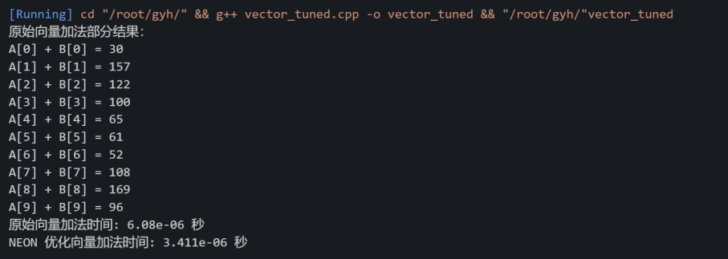

> 源 doc 实验报告未开放下载功能，下文为强制爬取文字后由 AI 恢复格式后转录到 md 文件的版本。

# 实验10：矩阵计算加速

## 1. 实验目的
1）学习矩阵乘法的基础原理，理解其计算复杂度对程序性能的影响  
2）学习毕昇编译器的基本使用  
3）掌握 ARM NEON 指令集的使用，理解向量化在高性能计算中的重要性及其实现方法  
4）掌握基础 KML_BLAS 库以及 KML_SPBLAS 库的使用方法，体验调用高性能库在实际工程中的优势与便捷性，理解其作为“黑盒”优化器的价值。

## 2. 实验任务
1）分别实现稠密矩阵乘法和稀疏矩阵乘法的基础版本。  
2）用毕昇编译器编译进行对比。  
3）理解 ARM NEON 指令集的基本用法，通过向量化指令加速前面两种矩阵计算。  
4）理解 KML_BLAS 库的基本用法，通过指令加速两种矩阵的运算。  
5）理解 KML_SPBLAS 库的基本用法，通过指令加速两种矩阵的运算。  
6）测量代码的运行时间，分析在稀疏和稠密两种不同情况下 NEON 指令集以及 KML_BLAS 库以及 KML_SPBLAS 的加速效果。

## 3. 实验原理

### 1) 矩阵乘法
矩阵乘法在线性代数和科学计算中应用广泛，其计算复杂度为 $O(n^3)$，当矩阵规模较大时，计算量和内存需求都较高。矩阵乘法的代码如下所示：

```cpp
for (int i = 0; i < maxsize; i++) {
    for (int j = 0; j < maxsize; j++) {
        for (int k = 0; k < maxsize; k++) {
            c[i][j] += a[i][k] * b[k][j];
        }
    }
}
```

### 2) 使用 NEON 指令集优化矩阵乘法
优化后的代码如下所示，通过使用 NEON 指令集提供的函数 `int32x4_t` 将待乘矩阵 a, b 以及结果矩阵 c 分别向量化加载，再使用 `vmlaq_s32` 函数将矩阵 a, b 相乘，通过数据类型定义以及合理的循环体结构安排，每次执行 4 个 32 位整数向量型变量的乘法加法操作。在内层循环中，通过加载一次矩阵 B 和矩阵 C 的部分数据，以及利用向量化指令同时处理多个元素，可以显著提高矩阵乘法的计算速度。最后，将运算结果通过 `vst1q_s32` 函数传递给结果矩阵 c，完成矩阵乘法运算。

```cpp
for (int i = 0; i < maxsize; i++) {
    for (int k = 0; k < maxsize; k++) {
        int32x4_t vector_a = vdupq_n_s32(a[i][k]);
        for (int j = 0; j < maxsize; j += 4) {
            int32x4_t vector_b = vld1q_s32(&b[k][j]);
            int32x4_t vector_c = vld1q_s32(&c[i][j]);
            vector_c = vmlaq_s32(vector_c, vector_a, vector_b);
            vst1q_s32(&c[i][j], vector_c);
        }
    }
}
```

### 3) 使用华为 KML_BLAS 库优化矩阵乘法
BLAS (Basic Linear Algebra Subprograms) 提供了一系列基本线性代数运算函数的标准接口，包括矢量线性组合、矩阵乘以矢量、矩阵乘以矩阵等功能。BLAS 已被广泛应用于工业界和科学计算，成为业界标准。KML_BLAS 库提供 BLAS 函数的 C 语言接口。

参考 - gemm - KML_BLAS Level 3 函数 - 函数定义 - KML_BLAS 库函数说明 - 基础数学库 - 开发指南（KML） - 数学库 - 鲲鹏加速库开发文档 - 鲲鹏社区 - gemm  
https://www.hikunpeng.com/document/detail/zh/kunpengaccel/math-lib/devg-kml/kunpengaccel_kml_0605.html

### 4) 使用华为 KML_SPBLAS 优化矩阵的乘法
KML_SPBLAS 库是稀疏矩阵 (Sparse Matrix) 的基础代数运算库，稀疏矩阵是指大部分矩阵元素为零的矩阵。

参考 kml_sparse_?csrmultd - Sparse BLAS Level 2 和 Level 3 函数 - 函数定义 - KML_SPBLAS 库函数说明 - 基础数学库 - 开发指南（KML） - 数学库 - 鲲鹏加速库开发文档 - 鲲鹏社区 - kml_sparse_?csrmultd  
https://www.hikunpeng.com/document/detail/zh/kunpengaccel/math-lib/devg-kml/kunpengaccel_kml_0039.html

### 5) 矩阵
稠密矩阵（Dense Matrix）是指矩阵中大部分元素为非零值，非零元素占比显著高于零元素的矩阵。与之相反，稀疏矩阵（Sparse Matrix）中零元素数目远多于非零元素，且非零元素分布无规律。在本文中定义稠密矩阵为 0 元素占比低于 10%，稀疏矩阵为非 0 元素占比低于 10%。优化稀疏矩阵乘法的核心目标是减少零值计算和内存开销，以下是几种经典算法：  
*   三元组表示法（Triple Storage）：仅存储非零元素的(行号, 列号, 值)，避免零值运算；  
*   分块计算（Blocking）：将矩阵划分为小块，利用局部性原理减少内存访问延迟；  
*   并行化与异构计算：GPU 通过重新排序非零元素消除负载不平衡实现加速；FPGA 采用稀疏感知的合并树结构实现优化；  
*   动态规划与矩阵连乘：通过调整计算顺序减少乘法次数；  
*   哈希表优化（Dictionary of Keys）：用哈希表存储非零元素，直接定位相乘位置。

## 4. 实验内容

### 步骤1：矩阵乘法
*   定义矩阵大小：在代码中定义矩阵大小，可简单定义为 SIZE=1024 的方阵。
*   矩阵内存分配：在 main() 函数中动态分配两个输入矩阵 A 和 B，以及结果矩阵 C 的内存。  
    *   提示：使用动态分配（new）二维数组，完成后确保内存释放。
    
*   初始化矩阵数据：将 A 和 B 矩阵的每个元素随机初始化（如 rand()%100）。同时对于稠密矩阵不需要额外处理，对于稀疏矩阵应该随机选取 90% 作为 0 元素。
*   实现乘法函数：编写函数 matmul(float** A, float** B, float** C, int n)，通过三重循环实现矩阵乘法。  
    提示：`C[i][j]` 的值为 `A[i][k]*B[k][j]` 逐项累加。
*   计时并输出：在 main() 函数中使用 clock() 计时，输出基础矩阵乘法的运行时间。

### 步骤2：使用毕昇编译器
*   使用毕昇编译器编译步骤 1 代码，将 1 中编译方式 gcc 改为 clang 即可。
*   计时并输出：在 main() 函数中使用 clock() 计时，输出基础矩阵乘法的运行时间。

### 步骤3：使用 NEON 统一向量化优化两种矩阵乘法
*   包含 NEON 头文件：在代码开头添加 `#include <arm_neon.h>` 以启用 NEON 指令。实现客户端接收来自服务器的广播消息。 
*   编写 NEON 优化函数：实现 matmul_optimized(float** A, float** B, float** C, int n)，使用 NEON 指令进行向量化矩阵乘法。
    *   向量加载：在内层循环中，使用 `vld1q_f32` 将矩阵 A 和 B 的 4 个连续元素加载到 `float32x4_t` 类型的向量中。
    *   向量乘法和累加：使用 `vmlaq_f32` 完成 A 和 B 的对应元素相乘并累加到结果向量 `vecC` 中。
    *   向量还原：使用 `vgetq_lane_f32` 提取累加结果，并存储到 `C[i][j]` 中。

*   计时并输出：在 main() 中使用 clock() 对优化版本计时，并输出运行时间。

### 步骤4：使用 KML_BLAS 库优化两种矩阵乘法
*   头文件链接源码：`#include <kblas.h>`
*   内存分配：`posix_memalign` 64B 对齐申请 A/B/C 一维数组，映射为 float* 即可与 KML 对接。
*   执行 `cblas_sgemm`
*   编译追加：`-I/usr/local/kml/include -L/usr/local/kml/lib/neon/kblas/nolocking -lkblas`
*   计时与输出

### 步骤5：使用 KML_SPBLAS 库优化两种矩阵乘法
*   头文件与链接源码顶部加 `#include <kml_spblas.h>`
*   编译追加：`-I/usr/local/kml/include -L/usr/local/kml/lib/neon/kspblas/single -lkspblas`
*   稀疏内存分配：在 main() 内先把动态二维 float** A_dense 按 CSR 三数组转换：`rowptr[1025] colidx[nnz] values[nnz]`（nnz≈105000）
*   执行 `kml_sparse_scsrmultd`
*   计时与输出

### 步骤6：结果对比与分析
*   记录基础两种矩阵乘法的运行时间，同时记录毕昇编译 NEON 和 华为 KML 库优化对应矩阵乘法的运行时间。
*   分析各种优化的加速效果，并总结向量化计算在向量加法和矩阵乘法中的优点和局限性。

